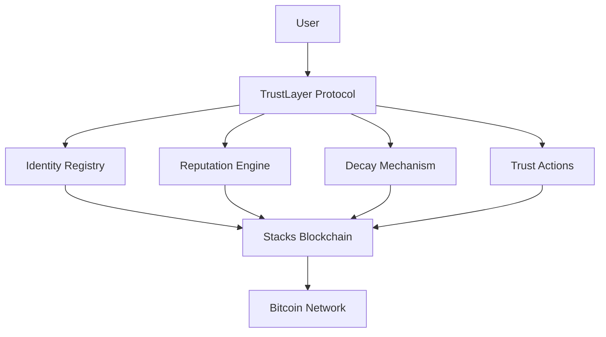

# TrustLayer Protocol


[](https://stacks.co)
[](https://bitcoin.org)
[](https://clarity-lang.org)

**A revolutionary Bitcoin-native smart contract protocol for decentralized trust management**

[Documentation](#documentation) • [Quick Start](#quick-start) • [API Reference](#api-reference) • [Contributing](#contributing)

---

## 📋 Table of Contents

- [Overview](#overview)
- [Features](#features)
- [Architecture](#architecture)
- [Quick Start](#quick-start)
- [Smart Contract Functions](#smart-contract-functions)
- [Trust Actions](#trust-actions)
- [API Reference](#api-reference)
- [Testing](#testing)
- [Deployment](#deployment)
- [Security](#security)
- [Contributing](#contributing)
- [License](#license)

---

## 🌟 Overview

**TrustLayer Protocol** is a paradigm-shifting decentralized trust management system built on Stacks, leveraging Bitcoin's immutable security. The protocol establishes a comprehensive trust infrastructure for the Bitcoin economy, enabling verifiable reputation scoring, temporal decay mechanisms, and cross-platform trust verification.

### Key Capabilities

- 🏛️ **Decentralized Identity Registry** - Self-sovereign identity management
- 📊 **Dynamic Reputation Scoring** - Algorithmic trust quantification
- ⏰ **Temporal Decay Mechanisms** - Time-based reputation adjustment
- 🔐 **Bitcoin-Native Security** - Inherits Bitcoin's security guarantees
- 🌐 **Cross-Platform Verification** - Universal trust validation
- 🎯 **Threshold-Based Access Control** - Reputation-gated functionality

---

## ✨ Features

### Core Features

| Feature | Description | Status |
|---------|-------------|---------|
| **Identity Registration** | Self-service identity creation and management | ✅ Production Ready |
| **Reputation System** | Dynamic scoring with configurable actions | ✅ Production Ready |
| **Decay Mechanism** | Automatic reputation decay over time | ✅ Production Ready |
| **Trust Actions** | Configurable reputation-earning activities | ✅ Production Ready |
| **Threshold Verification** | Reputation-based access control | ✅ Production Ready |
| **Admin Controls** | Protocol governance and configuration | ✅ Production Ready |

### Advanced Features

- **Temporal Reputation Decay**: Automatic reputation reduction over time to ensure active participation
- **Action-Based Scoring**: Configurable point system for different trust-building activities
- **Multi-threshold Support**: Flexible reputation requirements for different access levels
- **Protocol Governance**: Admin controls for system configuration and trust action management

---

## 🏗️ Architecture

### System Components



### Data Structures

#### Identity Profile

```clarity
{
  reputation: uint,        // Current reputation score (0-1000)
  created-at: uint,       // Block height when created
  last-updated: uint,     // Last reputation update block
  last-decay: uint,       // Last decay application block
  active: bool,           // Identity status
}
```

#### Trust Action Configuration

```clarity
{
  points: uint,           // Reputation points awarded
  active: bool,           // Action availability status
}
```

---

## 🚀 Quick Start

### Prerequisites

- [Clarinet](https://github.com/hirosystems/clarinet) v2.0+
- [Node.js](https://nodejs.org/) v18+
- [Git](https://git-scm.com/)

### Installation

1. **Clone the repository**

   ```bash
   git clone https://github.com/adeshola-code/trust-layer.git
   cd trust-layer
   ```

2. **Install dependencies**

   ```bash
   npm install
   ```

3. **Run tests**

   ```bash
   npm test
   ```

4. **Start local development**

   ```bash
   clarinet console
   ```

### Basic Usage

#### Register a New Identity

```clarity
(contract-call? .trust-layer register-identity)
```

#### Execute a Trust Action

```clarity
(contract-call? .trust-layer execute-action "lightning-channel")
```

#### Check Reputation

```clarity
(contract-call? .trust-layer get-reputation 'SP1HTBVD3JG9C05J7HBJTHGR0GGW7KX975CN9QKF)
```

---

## 📚 Smart Contract Functions

### Public Functions

#### Core Identity Management

| Function | Parameters | Returns | Description |
|----------|------------|---------|-------------|
| `register-identity` | - | `(response uint uint)` | Register new identity with default reputation |
| `execute-action` | `action: string-ascii` | `(response uint uint)` | Execute trust action to earn reputation |

#### Administrative Functions

| Function | Parameters | Returns | Description |
|----------|------------|---------|-------------|
| `set-admin` | `new-admin: principal` | `(response bool uint)` | Transfer admin privileges |
| `set-active` | `status: bool` | `(response bool uint)` | Enable/disable protocol |
| `add-trust-action` | `action: string-ascii`, `points: uint` | `(response bool uint)` | Configure new trust action |

### Read-Only Functions

| Function | Parameters | Returns | Description |
|----------|------------|---------|-------------|
| `get-reputation` | `owner: principal` | `(optional uint)` | Get user's current reputation |
| `get-profile` | `owner: principal` | `(optional {profile})` | Get complete user profile |
| `verify-threshold` | `owner: principal`, `threshold: uint` | `bool` | Check if user meets reputation threshold |
| `get-protocol-info` | - | `{protocol-info}` | Get protocol configuration and stats |

---

## 🎯 Trust Actions

The protocol includes pre-configured trust actions that users can execute to earn reputation:

| Action | Points | Description |
|--------|--------|-------------|
| `lightning-channel` | 10 | Opening Bitcoin Lightning Network channels |
| `governance-vote` | 5 | Participating in protocol governance |
| `defi-interaction` | 15 | Engaging with DeFi protocols |
| `contract-deploy` | 20 | Deploying verified smart contracts |
| `security-audit` | 25 | Contributing to security audits |

### Adding Custom Trust Actions

Administrators can add new trust actions:

```clarity
(contract-call? .trust-layer add-trust-action "new-action" u15)
```

---

## 🔧 API Reference

### Error Codes

| Code | Constant | Description |
|------|----------|-------------|
| `u100` | `ERR-UNAUTHORIZED` | Unauthorized access attempt |
| `u101` | `ERR-INVALID-PARAMETERS` | Invalid function parameters |
| `u102` | `ERR-IDENTITY-EXISTS` | Identity already registered |
| `u103` | `ERR-IDENTITY-NOT-FOUND` | Identity not found in registry |
| `u104` | `ERR-INSUFFICIENT-REPUTATION` | Insufficient reputation for action |
| `u105` | `ERR-NOT-ADMIN` | Admin privileges required |

### System Constants

| Constant | Value | Description |
|----------|-------|-------------|
| `MAX-REPUTATION` | 1000 | Maximum achievable reputation |
| `MIN-REPUTATION` | 0 | Minimum reputation floor |
| `DEFAULT-REPUTATION` | 50 | Starting reputation for new users |
| `DECAY-RATE` | 10% | Reputation decay percentage |
| `DECAY-PERIOD` | 10000 blocks | Blocks between decay applications |

---

## 🧪 Testing

### Running Tests

```bash
# Run all tests
npm test

# Run tests with coverage
npm run test:report

# Watch mode for development
npm run test:watch
```

### Test Structure

```
tests/
├── trust-layer.test.ts     # Core functionality tests
├── integration/            # Integration test suites
└── utils/                  # Testing utilities
```

### Writing Tests

Example test case:

```typescript
import { describe, expect, it } from "vitest";

describe("TrustLayer Protocol", () => {
  it("should register new identity successfully", () => {
    const response = simnet.callPublicFn(
      "trust-layer",
      "register-identity",
      [],
      accounts.get("wallet_1")!
    );
    
    expect(response.result).toBeOk(Cl.uint(50));
  });
});
```

---

## 🚀 Deployment

### Local Deployment

1. **Start Clarinet console**

   ```bash
   clarinet console
   ```

2. **Deploy contract**

   ```clarity
   ::deploy_contracts
   ```

### Testnet Deployment

1. **Configure testnet settings**

   ```bash
   clarinet deployments generate --devnet
   ```

2. **Deploy to testnet**

   ```bash
   clarinet deployments apply --devnet
   ```

### Mainnet Deployment

> ⚠️ **Warning**: Ensure thorough testing before mainnet deployment

1. **Generate mainnet deployment plan**

   ```bash
   clarinet deployments generate --mainnet
   ```

2. **Deploy to mainnet**

   ```bash
   clarinet deployments apply --mainnet
   ```

---

## 🛡️ Security

### Security Features

- **Bitcoin Security Model**: Inherits Bitcoin's proof-of-work security
- **Immutable Contracts**: Deployed contracts cannot be modified
- **Access Controls**: Admin-only functions for critical operations
- **Input Validation**: Comprehensive parameter validation
- **Overflow Protection**: Safe arithmetic operations

### Security Considerations

- **Admin Key Management**: Secure admin private key storage
- **Reputation Manipulation**: Monitor for gaming attempts
- **Decay Parameters**: Carefully tune decay rates
- **Action Configuration**: Validate trust action point values

### Audit Status

- [ ] Internal Security Review
- [ ] External Security Audit
- [ ] Formal Verification
- [ ] Bug Bounty Program

---

## 🤝 Contributing

We welcome contributions from the community! Please see our [Contributing Guide](CONTRIBUTING.md) for details.

### Development Setup

1. Fork the repository
2. Create a feature branch
3. Make your changes
4. Add tests for new functionality
5. Ensure all tests pass
6. Submit a pull request

### Code Standards

- Follow Clarity best practices
- Include comprehensive tests
- Document all public functions
- Use descriptive variable names
- Add inline comments for complex logic

---

## 📄 License

This project is licensed under the MIT License - see the [LICENSE](LICENSE) file for details.

---

## 🙏 Acknowledgments

- **Stacks Foundation** - For the Stacks blockchain infrastructure
- **Hiro** - For Clarity development tools
- **Bitcoin Community** - For the foundational security model
- **Contributors** - For making this project possible
